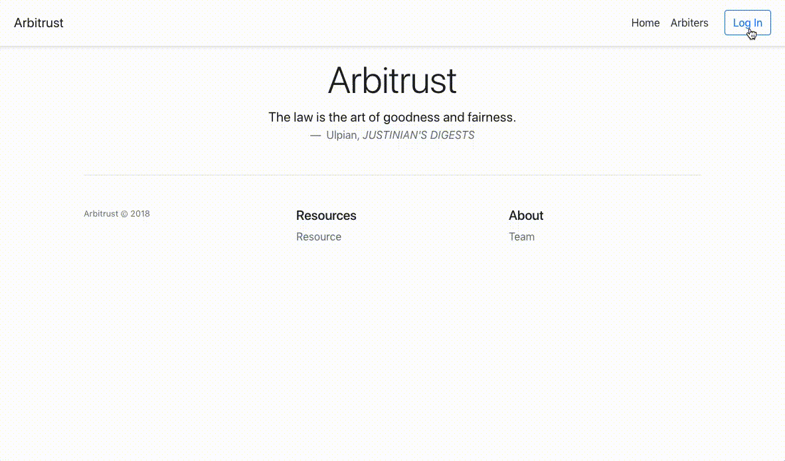

# arbitrust_poc
PoC of alternative dispute resolution layer based on Blockchain and IPFS

Communication between parties is maintained through OP_RETURN on Blockchain network.

The submitted Request triggers an automatic process of arbitrator selection within the Blockchain network from the Pool of Arbitrators. The list of the Pool of Arbitrators is fixed into the moment of the 1th block linked to the Request. Every selected Arbitrator is removed from the list of PoA after specific block in selection and Arbitrators are reordered for the next block. When the transaction is linked to the 1st block of the Blockchain, selection of arbitrators starts in this sequence:

1. Arbitrator selected in 6th block =  Nonce(6th Block) mod ∑ (All Arbitrators)
2. Arbitrator selected in 7th block =  Nonce(7th Block) mod ∑ (All Arbitrators - (1st selected arbitrator))
3. Arbitrator selected in 8th block = Nonce(8th Block) mod ∑ (All Arbitrators - (1st & 2nd selected arbitrator))

etc.

